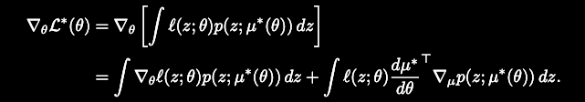
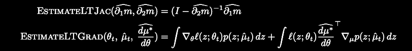
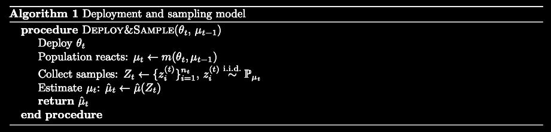
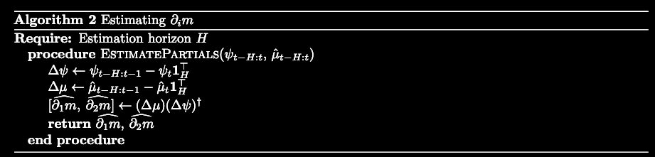
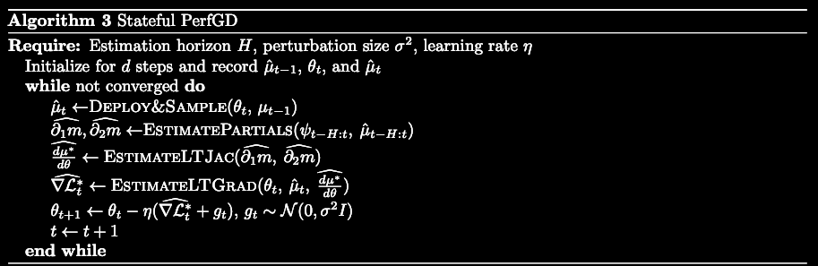
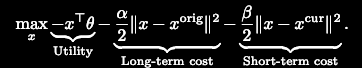
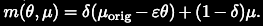
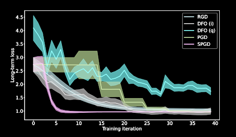

<!-- .slide: data-transition="slide" data-background="#b5533c" data-background-transition="zoom"--> 
## How to Learn when Data Gradually Reacts to Your Model
paper by Zachary Izzo, James Zou, Lexing Ying
Presentation by
###  Kimia Kazemian
31/10/2022

---

## what is this about?
* Problem: training ML models in the performative setting. {.fragment .fade-in-then-semi-out}
* Goal: minimize perforative risk: model loss on the distribution it induces. {.fragment .fade-in-then-semi-out}
* Previous work: induced data distribution depends only on the deployed model. {.fragment .fade-in-then-semi-out}
* Too simplistic? dependence on the “state”{.fragment .fade-in-then-semi-out} 
* Example: credit score  {.fragment .fade-in-then-semi-out} 
* Contribution: meta algorithm{.fragment .fade-in} 

<aside class="notes">
i.e. when the data distribution reacts to the deployed model
the scenario in which our deployed model or algorithm effects the distribution of the data or population which we are studying

GOAL: A model favorable data distribution and performs well on the induced distribution

Previous Work: Assumes that the data distribution immediately adapts to the deployed model

In practice, however, this may not be the case, as the population may take time to adapt to the model. In many applications, the data distribution depends on BOTH the currently deployed ML model and on the “state” that the population was in before the model was deployed

BANK loans: people with more credit lines open are more likely to repay their loans. distribution of the outcome has changed, 

BANK:so we can expect the distribution to change grad- ually as applicants have more time to adapt, before finally settling to some steady-state distribution
</aside>

---

## Problem setup

<ul>
    <li class="fragment fade-in" data-fragment-index="0">$D : \Theta × M(Z) → M(Z)$</li>
    <li class="fragment fade-in" data-fragment-index="1">$\Theta$: set of admissible model parameters</li>
    <li class="fragment fade-in" data-fragment-index="2"> $Z$: data sample space.</li>
    <li class="fragment fade-in" data-fragment-index="3">$M(Z)$: set of probability measures on $Z$.</li>
    <li class="fragment fade-in" data-fragment-index="4">
      

        $\rho_t = D(\theta_t, \rho_{t−1}).$
        $\mu_t=m(\theta_t,\mu_{t-1})$
      

    </li>
    <li class="fragment fade-in" data-fragment-index="5">
      

        $\rho_∗(\theta) = \underset{t\to\infty} {lim}  \rho_t \hspace{0.5em}$ where $\hspace{0.5em}\theta_t ≡ \theta \hspace{0.5em}$ for all $t$
        $\mu_*=\underset{k \to \infty}{lim} \hspace{0.5em} m^{(k)}(\theta,\mu_{k-1})$
      

    </li>
    <li class="fragment fade-in" data-fragment-index="6">$\theta_{OPT}=\underset{\theta \in \Theta}{argmin \hspace{0.5em}} \mathcal{L}^*(\theta)$</li>
    <li class="fragment fade-in" data-fragment-index="7">Assume $\rho_t$ belongs to a parametric family with parameter $\mu_t$ and density $p(.,\mu_t)$</li>
</ul>

<aside class="notes">
note: We assume that there is a distribution map
note: If rho_t denotes the data distribution at time t and theta_t denotes the model that we deploy at time t, then we have
Under reasonable regularity conditions on D, if we define theta_t ≡ theta$ for all t, then there exists a limiting distribution
</aside>

---

## Problem setup

* Assume $\theta,\mu \in \mathbb{R}^d$ {.fragment .fade-in-then-semi-out}
* $\partial_i f$ denotes derivative wrt $i$th argument {.fragment .fade-in-then-semi-out}
* $\psi_t = \[\theta_t^\top, \mu_t^\top\] ^\top$ denotes the full input to $m$ at time $t$, and for any collection of vectors $v_i, v_{i:j}$ denotes the matrix with columns $v_i, v_{i+1}, ..., v_j$. {.fragment .fade-in-then-semi-out}

---

<!-- .slide: data-transition="slide" data-background="#000000" data-background-transition="zoom" -->
## How do we do it?
 {.fragment .fade-in}
 
 {.fragment .fade-in}

<aside class="notes">
There are two unknown quantities in this expression: μ∗(θ) and dμ∗
</aside>

---

<!-- .slide: data-transition="slide" data-background="#000000" data-background-transition="zoom" -->

## How do we do it?
{.fragment .fade-in-then-semi-out}
{.fragment .fade-in-then-semi-out}

<aside class="notes">
Algorithm 2 estimates the derivatives of m using finite difference approximations gathered from the optimization trajectory so far.
</aside>

---

<!-- .slide: data-transition="slide" data-background="#000000" data-background-transition="zoom" -->

## How do we do it?

{.fragment .fade-in-then-semi-out}

---

## low dimensional statistics?
* Observation: individuals modify their behavior based on a low- dimensional proxy, such as a credit score or classification probability {.fragment .fade-in-then-semi-out}
* How can we apply stateful PerfGD for a high-dimensional model without incurring a large error due to the high dimension? {.fragment .fade-in-then-semi-out}

* $\mu_t = m(\theta_t,\mu_{t-1})= \bar{m}(s(\theta_t,\mu_{t-1}),\mu_{t-1})$ 
$s(\theta,\mu)\in \mathbb{R}^{d_s}$ and $d_s \ll dim(\theta)$ {.fragment .fade-in-then-semi-out}
* $\partial_1 s(\theta_t,\mu_{t-1})=\partial_1 \bar{m}(s_t,\mu_{t-1})\partial s(\theta_t,\mu_{t-1})$ {.fragment .fade-in-then-semi-out}
 
<aside class="notes">
Unless the population being model consists mostly of data scientists, it is unlikely that the constituent individuals will have a reaction based on the particular parameters of the model

DISTRIBUTION SHIFT DEPENDS ON LOW DIMENSIONAL STATISTICS,

s is KNOWN
computing ∂1s(θt, μt−1) just requires estimating μt−1
estimate the derivative ∂1m ̄ . This is a derivative with respect to ds variables, whereas in general for this step we must compute a derivative with respect to dim(θ) variables.
</aside>

---

<!-- .slide: data-transition="slide" data-background="#000000" data-background-transition="zoom" -->
## experiments

 spam classification: 

 Reference:[Strategic classification](https://arxiv.org/pdf/1506.06980.pdf) 

<aside class="notes">
Each spammer has some original message, denoted by the features xorig, that they would like to send. This should not be thought of as an actual saved message, but rather encoding the information (e.g. a virus, scam, etc.) that they want to deliver to their victims. Their message also has a current form, denoted by the features xcur
The utility corresponds to the spammers’ desire to receive a negative (non-spam) classification from our deployed logistic model.
</aside>

---

## what else?
* societal impacts: possibly maximize a certain measure of negative externality {.fragment .fade-in-then-semi-out}

* future work: what are our assumptions? {.fragment .fade-in}

  * deterministic MDP {.fragment .fade-in-then-semi-out}
    
  * batch setting {.fragment .fade-in-then-semi-out}

<aside class="notes">
When the population in question consists of people, this amounts to trying to induce these people to behave in a way which makes them easy to classify, which may not align with behaviors that benefit these people the most. Indeed, it has been observed that in some cases, such a procedure can maximize a certain measure of negative externality (Jagadeesan et al., 2021). However, manipulation of the data distribution also has the capability to produce the opposite effect, i.e., inducing a data distribution which is advantageous both for the modeled population and the modeler.

highly structured Markov decision process, but relaxing some of the assumptions on the underlying MDP is of interest for improving the practical efficacy of this setting, and offers the potential for connections with reinforcement learning
ur current method works in the batch setting where we have enough samples to accurately estimate population-level quantities. Developing methods that can work in a stochastic/limited sample regime is also of interest.

</aside>

 Reference: [Alternative microfoundations for strategic
classification](https://arxiv.org/abs/2106.12705)  {.fragment .fade-in}

---

<!-- .slide: data-transition="slide" data-background="#b5533c" data-background-transition="zoom"--> 
### fin
